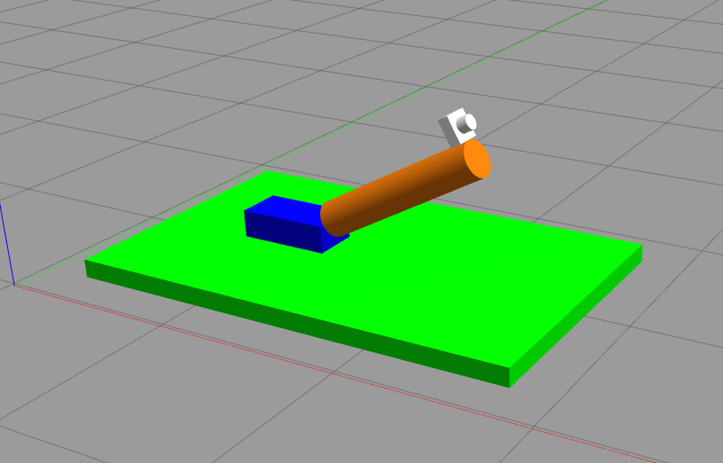

# Camera Robot Package for ROS

This package contains a simple robot model with a camera. It consists of one prismatic joint and one revolute joint.



This package is based on the [joshnewans/urdf_example](https://github.com/joshnewans/urdf_example) package.

## Installation

Clone this repository into your catkin workspace and build it:

```bash
cd ~/catkin_ws/src
git clone
cd ..
catkin_make
```

## Usage

To launch the robot model in RViz, run the following command:

```bash
roslaunch camera_robot robot.launch
```
Use the sliders from joint_state_publisher to move the joints of the robot.

To launch the robot model in Gazebo, run the following command:

```bash
roslaunch camera_robot gazebo.launch
```
You can move the joints of the robot by publishing to the following topics:

```bash
rostopic pub -1 /camera_robot/slider_joint_position_controller/command std_msgs/Float64 "data: 1.2"

rostopic pub -1 /camera_robot/arm_joint_position_controller/command std_msgs/Float64 "data: 0.8"
```